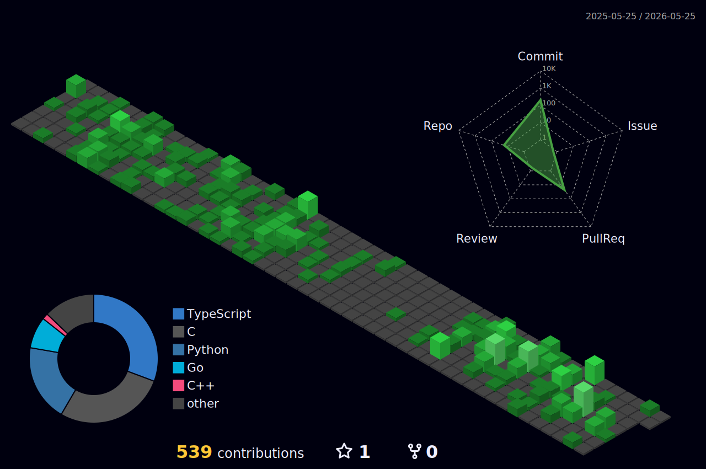

<div align="center">


<br/>

[](https://www.linkedin.com/in/vamshi-vavilla/)
[](http://vkr-vavilla.github.io/Portfolio/)
[](https://github.com/vkr-vavilla)
[](mailto:vkr.vavilla@gmail.com)

</div>

---

## About Me

```python
vamshi = {
    "degree":    "Honors BS Computer Engineering @ UT Arlington (GPA: 3.8)",
    "minors":    ["Cybersecurity", "Mathematics", "Physics"],
    "research":  ["CERN/Fermilab", "UTARI", "CyberGuard UTA", "Positron Lab"],
    "focus":     ["Cloud Security", "Embedded Systems", "ML Security Research"],
    "currently": "Research Engineer @ UTARI + Security RA @ CyberGuard",
    "seeking":   "New Grad / Internship roles in Security Engineering or Embedded",
}
```

---

## 🛡️ Experience

| Role | Organization | Period |
|------|-------------|--------|
| Research Engineer — Smart Seat Cushion | **UTARI Biomedical Technologies** | Aug 2025 – Present |
| Research Assistant — AutoExPo+ | **CyberGuard at UTA** | Sep 2025 – Present |
| Research Intern — ML & Cryogenic Electronics | **CERN / Fermilab** | Jan 2023 – May 2025 |
| Research Intern — Robotics | **UTA Research Institute** | Aug 2024 – Jan 2025 |
| Research Assistant — Antimatter Spectroscopy | **Positron Laboratory, UTA** | Aug 2023 – May 2024 |
| PLTL Tutor — Calculus & CS | **University of Texas at Arlington** | Jan 2024 – Sep 2025 |

---

## 🔧 Technical Skills

#### Languages
<p>
  
  
  
  
  
  
  
  
  
  
  
  
</p>

#### Cloud & Security
<p>
  
  
  
  
  
  
  
  
  
  
  
  
  
  
  
</p>

#### Embedded & Hardware
<p>
  
  
  
  
  
  
  
  
  
</p>

#### AI / ML & Data
<p>
  
  
  
  
  
  
  
  
</p>

---

## 🚀 Featured Projects

<table>
<tr>
<td width="50%" valign="top">

### 🔐 [Cloud Threat Pipeline](https://github.com/vkr-vavilla/cloud-threat-pipeline)
Terraform-provisioned Lambda pipeline that parses CloudTrail events and detects 5 attack scenarios. SNS + Slack alerting with a full pytest suite requiring zero live AWS dependencies.

`AWS` `Terraform` `Lambda` `Python` `Docker` `LocalStack`

</td>
<td width="50%" valign="top">

### 🛡️ [GCP Security Posture Automation](https://github.com/vkr-vavilla/gcp-security-posture-automation)
Audits GCP projects against 9 CIS Benchmark controls across IAM, Cloud Storage, and Service Accounts. Outputs NIST SP 800-53 mapped remediation reports with credential-free CI testing.

`Python` `GCP` `Security Command Center` `CIS Benchmarks` `pytest`

</td>
</tr>
<tr>
<td width="50%" valign="top">

### 🤖 [LLM Evaluation Framework](https://github.com/vkr-vavilla/LLM_Evaluation)
Benchmarks RAG-generated WAV exploit payloads against 11+ CVEs in libsndfile. Integrates Levenshtein similarity scoring and P50/P95/P99 latency profiling into a GitHub Actions CI pipeline.

`Python` `Go` `FastAPI` `RAG` `CI/CD` `CVE Research`

</td>
<td width="50%" valign="top">

### ⚡ [Automated Incident Response Pipeline](https://github.com/vkr-vavilla/cloud_sec_ops)
Zero-trust AWS architecture that cut incident response time by 95%. Python Lambda ingests Suricata EVE alerts and achieved 100% quarantine rate on simulated SSH brute-force campaigns.

`AWS` `Terraform` `Suricata` `Python` `DynamoDB` `SQS`

</td>
</tr>
<tr>
<td width="50%" valign="top">

### 🖥️ [Custom xv6 Kernel](https://github.com/vkr-vavilla/xv6Plus_Custom-Kernel)
Added thread-safe buffer cache and Shared Memory IPC to xv6 with fine-grained spinlocks, cutting disk I/O latency by 30%. Hardened via syscall wrappers and fault injection stress tests.

`C` `x86 Assembly` `OS Internals` `Memory Management`

</td>
<td width="50%" valign="top">

### 🎮 [GPU-Accelerated MD5 Cracker](https://github.com/vkr-vavilla/cuda_md5_cracker)
CUDA brute-force cracker hitting **82.5B hashes/sec** (~16,800x over CPU). Optimized with constant memory, coalesced reads, and loop unrolling across 60M+ parallel candidates.

`CUDA` `C` `GPU Programming` `Cryptography`

</td>
</tr>
<tr>
<td width="50%" valign="top">

### 📡 [SDR Wireless Exploitation Framework](https://github.com/vkr-vavilla/Wireless_Comm)
RF spoofing framework on ARM Cortex-M4 that bypassed IoT authentication with 100% payload injection rate. MATLAB SDR pipeline with FFT-based carrier recovery cut decryption time by 85%.

`Embedded C` `MATLAB` `RF Security` `ARM Cortex-M4`

</td>
<td width="50%" valign="top">

### 🌐 [AI Interview Platform](https://github.com/vkr-vavilla/Senior_Design)
Real-time interview platform with sub-400ms latency and 98% transcription accuracy. Groq Whisper, Orpheus TTS, async WebSockets, and RAG-driven scorecards on AWS.

`Next.js` `FastAPI` `AWS` `RAG` `WebSockets` `Docker`

</td>
</tr>
</table>

---

## 🏅 Certifications

<p>
  <a href="https://www.coursera.org/account/accomplishments/specialization/X2LVZQYBAEPO"></a>
  
  <a href="https://www.coursera.org/account/accomplishments/specialization/P653TWUGZZQV"></a>
  <a href="https://drive.google.com/file/d/1MCzFIviCAJepAlLdgS1JfROhgEEIEzkp/view?usp=sharing"></a>
  <a href="https://drive.google.com/file/d/1brh1O0nHI32Ak7i2ZP6T_lvRGX_HpKyj/view?usp=sharing"></a>
  <a href="https://forage-uploads-prod.s3.amazonaws.com/completion-certificates/mfxGwGDp6WkQmtmTf/vcKAB5yYAgvemepGQ_mfxGwGDp6WkQmtmTf_iQve2okzGHSqhxcPn_1743127200003_completion_certificate.pdf"></a>
</p>

---

## 📊 GitHub Stats

<div align="center">


</div>

<div align="center">


</div>

---

## 🌐 3D Contribution Graph

<div align="center">
  
</div>

---

<div align="center">

**📫 Open to cloud security, embedded security, and security engineering roles**

[](mailto:vkr.vavilla@gmail.com)
[](https://www.linkedin.com/in/vamshi-vavilla/)

</div>
